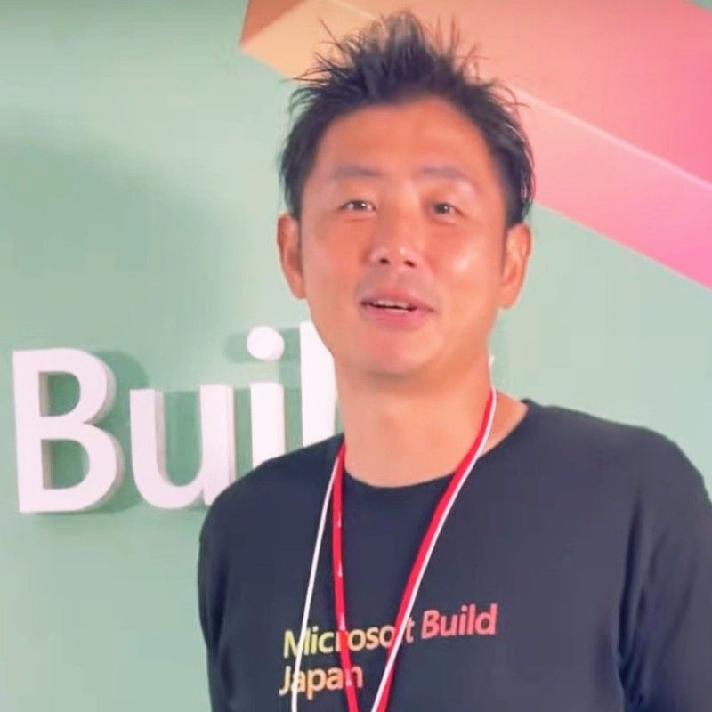

<!-- Language Toggle -->

  <button class="lang-btn active" onclick="setLang('en')">EN</button>
  <button class="lang-btn" onclick="setLang('ja')">JA</button>

<!-- English Content -->

OPEN TO WORK

# Masato Kikukawa

<a href="mailto:kikukawa@stack-bee.io">kikukawa@stack-bee.io</a>
<a href="https://www.linkedin.com/in/kikukawa9/">LinkedIn</a>
<a href="https://github.com/StackBeeDash">GitHub</a>

---

## Summary

IT professional with over 20 years of experience, specializing in cloud technologies, software development, and technical education. Career includes significant roles at Microsoft Japan and TOPGATE. Currently providing training and full-stack development services as a freelancer.

At Microsoft, focused on Azure infrastructure and cloud technologies, delivering comprehensive technical training on networking, virtual machines, storage, disaster recovery, and cloud applications. Successfully trained over 2,500 students with consistently high satisfaction scores.

Currently engaged in two primary areas:
- **Full-Stack Development**: End-to-end system development, business data analytics platforms, and offshore team management
- **Training**: Azure instructor on Udemy and official Microsoft courses through Trainocate, Fast Lane, and other global partners

---

## Experience

Freelance Trainer / Full-Stack Engineer

July 2025 - Present

- Deliver Azure online training through Udemy and customized content for enterprise clients
- Design and develop web applications and data analysis systems
- Build Facebook business data analytics systems for data-driven decision-making
- Manage offshore development teams, overseeing the entire development lifecycle

Achievements:

- Successfully launched and maintained Azure fundamentals courses on Udemy
- Directed multiple international projects with offshore teams
- Built partnerships with leading training companies (Trainocate, Fast Lane, Microsoft)

Microsoft Japan - Cloud Technical Trainer

February 2021 - July 2025

- Provided technical training for Azure infrastructure courses (networking, storage, VMs, disaster recovery, backup, cloud applications)
- Trained on AI solutions using ChatGPT's engine on Azure
- Provided training on big data analysis foundations (Spark, Databricks, Azure Synapse, Machine Learning)
- Created custom training materials to enhance learning effectiveness

Achievements:

- Delivered training at least 12 days per month
- Instructor Recognition: 1,500+ students reached
- Over 90% student satisfaction score
- Speaking at Microsoft Ignite event

TOPGATE - GCP Authorized Trainer

August 2019 - January 2021

- Offered official GCP training courses covering IaaS, PaaS, Kubernetes, Network, Load Balancing, Storage, Big Data, and ML
- Started the GCP training business from scratch
- Trained new authorized GCP trainers

Achievements:

- Launched training business from scratch
- Offered 3 GCP official training courses
- Student satisfaction average rating 4.6+ out of 5.0
- Trained 4 GCP trainers

Freelance Engineer

April 2017 - July 2019

- Online instructor of Python programming
- Web scraping development projects using Python and Selenium
- WordPress and Python (Flask) web application development

Achievements:

- Produced and offered 4 Udemy online courses
- Completed 4 full-stack development projects using Python

Healthcare Relations

January 2015 - May 2017

- Community medical system requirements, construction, deployment, and maintenance
- Regional collaboration wearable device IoT demonstration project

Achievements:

- Built medical network system connecting 50+ facilities
- Managed and completed difficult migration projects on schedule

Fuji Xerox - Medical / Product Planning / Software Development

April 2003 - December 2015

- In-hospital document management system development
- Network service product planning for SMEs
- Print system development for 20,000 convenience stores nationwide

Achievements:

- Doubled viewer component drawing speed of medical package system
- System introduction to large hospitals (1,000+ beds)
- Released 2 enterprise service products

---

## Education

**Master of Computer Science** - Waseda University (2003)

---

## Certifications

### Microsoft Certified Trainer (MCT) - Feb 2021 - Present

AI-050: Azure OpenAI Service

AI-102: Azure AI Solution

AI-900: Azure AI Fundamentals

AZ-104: Azure Administrator

AZ-204: Azure Developer

AZ-305: Azure Solutions Architect

AZ-400: Azure DevOps

AZ-700: Azure Networking

AZ-900: Azure Fundamentals

DP-100: Data Science on Azure

DP-203: Data Engineering

SC-300: Identity & Access Admin

### Google Cloud Certifications

Professional Cloud Architect (2019)

Associate Cloud Engineer (2020)

Authorized GCP Trainer (2019)

---

## Skills

| Category | Technologies |
|----------|--------------|
| **Cloud** | Azure, Google Cloud |
| **Training** | Course design, Instructional content creation, Udemy |
| **Programming** | C#, C++, Python, .NET, TypeScript |
| **Databases** | SQL Server, MySQL, Supabase, Redis, Cosmos DB, Firestore, etc. |
| **DevOps** | Docker, Kubernetes, GitHub Actions |
| **Full-Stack** | HTML, JavaScript, Python, Node.js |

---

[Back to Home](.){: .btn}

<!-- Japanese Content -->

OPEN TO WORK

# 菊川 正人

<a href="mailto:kikukawa@stack-bee.io">kikukawa@stack-bee.io</a>
<a href="https://www.linkedin.com/in/kikukawa9/">LinkedIn</a>
<a href="https://github.com/StackBeeDash">GitHub</a>

---

## 概要

20年以上の経験を持つITプロフェッショナル。クラウドテクノロジー、ソフトウェア開発、技術教育を専門とする。日本マイクロソフトとTOPGATEでの重要な役割を経て、現在はフリーランスとしてトレーニングとフルスタック開発サービスを提供。

マイクロソフトでは、Azureインフラストラクチャとクラウドテクノロジーに焦点を当て、ネットワーキング、仮想マシン、ストレージ、災害復旧、クラウドアプリケーションに関する包括的な技術トレーニングを提供。2,500人以上の受講生を指導し、常に高い満足度を獲得。

現在、主に2つの分野で活動:
- **フルスタック開発**: エンドツーエンドのシステム開発、ビジネスデータ分析プラットフォーム、オフショアチーム管理
- **トレーニング**: UdemyでのAzure講師、Trainocate、Fast Laneなどを通じたMicrosoft公式コース提供

---

## 職務経歴

フリーランス トレーナー / フルスタックエンジニア

2025年7月 - 現在

- Udemyを通じてAzureオンライン研修を提供、企業向けカスタマイズコンテンツを作成
- Webアプリケーションおよびデータ分析システムの設計・開発
- Facebookビジネスデータ分析システムの構築
- オフショア開発チームの管理、計画からリリースまでの全工程を監督

実績:

- UdemyでAzure基礎コースの立ち上げ・運営に成功
- 複数の国際プロジェクトを指揮、オフショアチームを管理
- 主要トレーニング企業（Trainocate、Fast Lane、Microsoft）とパートナーシップを構築

日本マイクロソフト株式会社 - クラウド技術トレーナー

2021年2月 - 2025年7月

- Azureインフラストラクチャコース（ネットワーク、ストレージ、VM、災害復旧、バックアップ、クラウドアプリ）の技術トレーニング提供
- Azure上でChatGPTエンジンを使用したAIソリューションのトレーニング
- ビッグデータ分析基礎（Spark、Databricks、Azure Synapse、機械学習）のトレーニング
- 学習効果向上のため独自教材を作成

実績:

- 月12日以上のトレーニング提供
- インストラクター表彰: 1,500人以上の学生を指導
- 学生満足度90%以上
- Microsoft Igniteイベントで登壇

TOPGATE - GCP認定トレーナー

2019年8月 - 2021年1月

- IaaS、PaaS、Kubernetes、ネットワーク、ロードバランシング、ストレージ、ビッグデータ、MLをカバーするGCP公式トレーニングコースを提供
- GCPトレーニング事業をゼロから立ち上げ
- 新規GCP認定トレーナーを育成

実績:

- トレーニング事業をゼロから立ち上げ
- 3つのGCP公式トレーニングコースを提供
- 学生満足度平均4.6点以上（5.0点満点）
- 4名のGCPトレーナーを育成

フリーランスエンジニア

2017年4月 - 2019年7月

- Pythonプログラミングのオンライン講師
- Python・Seleniumを使用したWebスクレイピング開発プロジェクト
- WordPressおよびPython (Flask) Webアプリケーション開発

実績:

- Udemyオンラインコースを4つ制作・提供
- Pythonを使用したフルスタック開発プロジェクトを4件完了

ヘルスケアリレーションズ

2015年1月 - 2017年5月

- 地域医療システムの要件定義・構築・導入・保守
- 地域連携ウェアラブルデバイスIoT実証実験プロジェクト

実績:

- 50以上の施設をつなぐ医療ネットワークシステムを構築
- 困難な移行プロジェクトを管理し、計画通りに完了

富士ゼロックス - メディカル / 商品企画 / ソフトウェア開発

2003年4月 - 2015年12月

- 院内文書管理システムの開発
- 中小企業向けネットワークサービス商品の企画
- 全国2万店のコンビニ向け印刷システム開発

実績:

- 医療パッケージシステムのビューア描画速度を2倍に改善
- 1,000床以上の大規模病院へシステム導入
- エンタープライズ向けサービス商品を2つリリース

---

## 学歴

**早稲田大学大学院 コンピュータサイエンス研究科 修士課程修了** (2003年)

---

## 認定資格

### Microsoft認定トレーナー (MCT) - 2021年2月 - 現在

AI-050: Azure OpenAI Service

AI-102: Azure AI Solution

AI-900: Azure AI Fundamentals

AZ-104: Azure Administrator

AZ-204: Azure Developer

AZ-305: Azure Solutions Architect

AZ-400: Azure DevOps

AZ-700: Azure Networking

AZ-900: Azure Fundamentals

DP-100: Data Science on Azure

DP-203: Data Engineering

SC-300: Identity & Access Admin

### Google Cloud認定資格

Professional Cloud Architect (2019)

Associate Cloud Engineer (2020)

Authorized GCP Trainer (2019)

---

## スキル

| カテゴリ | 技術 |
|---------|------|
| **クラウド** | Azure, Google Cloud |
| **トレーニング** | コース設計、教育コンテンツ作成、Udemy |
| **プログラミング** | C#, C++, Python, .NET, TypeScript |
| **データベース** | SQL Server, MySQL, Supabase, Redis, Cosmos DB, Firestore, etc. |
| **DevOps** | Docker, Kubernetes, GitHub Actions |
| **フルスタック** | HTML, JavaScript, Python, Node.js |

---

[ホームに戻る](.){: .btn}

