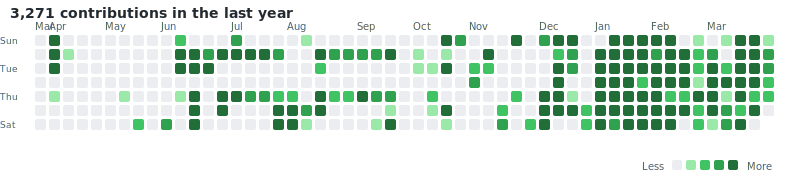

<!-- Language Toggle -->

  <button class="lang-btn active" onclick="setLang('en')">EN</button>
  <button class="lang-btn" onclick="setLang('ja')">JA</button>

<!-- English Content -->

OPEN TO WORK

# Masato Kikukawa

kikukawa@stack-bee.io
<a href="https://www.linkedin.com/in/kikukawa9/">LinkedIn</a>
<a href="https://github.com/StackBeeDash">GitHub</a>
<a href="https://x.com/StackBeeDash">X (Twitter)</a>

---

## Summary

IT professional with over 20 years of experience in cloud technologies, AI-driven development, and technical enablement. Career spans Microsoft Japan, TOPGATE, and current freelance work combining full-stack development with AI agent-powered workflows. Passionate about enabling teams and organizations to leverage AI for transformative productivity gains.

Currently focused on three areas:
- **AI-Driven Development**: Building production systems using AI pair programming (Claude Code), achieving 400%+ development acceleration
- **Business Process Optimization**: Transforming manual workflows into efficient, data-driven operations through AI automation
- **Technical Training & Enablement**: Delivering Azure/AI training with 2,500+ students trained and 90%+ satisfaction

---

## Key Highlights

**AI-Driven Innovation** --- Built full-stack production systems using AI agents (Claude Code), achieving 400%+ development acceleration and 80% cost reduction. Developed Ad Evaluation platform (349 commits in 3 weeks, ~2.4MB code) and Affiliate Management system (109 commits in 3 weeks, 310KB code) --- all driven by AI pair programming.

**Business Process Optimization** --- Dramatically streamlined business workflows through AI-driven automation, transforming manual processes into efficient, data-driven operations across multiple client engagements.

**Technical Enablement & AI Advocacy** --- Champion AI agent adoption within organizations, leading hands-on Claude Code training sessions and establishing AI-driven development practices for engineering teams.

**Proven Training Delivery** --- Delivered 320+ training sessions reaching 2,500+ students with 90%+ satisfaction. Recognized Microsoft trainer with Ignite speaking experience.

---

## GitHub Activity

---

## Experience

Freelance Trainer / Full-Stack Engineer

July 2025 - Present

- Build production systems using AI-driven development (Claude Code), achieving 400%+ acceleration over traditional workflows
- Deliver Azure online training through Udemy and customized content for enterprise clients
- Design and develop web applications, data analysis systems, and business process automation
- Champion AI agent adoption within organizations, leading hands-on training sessions
- Manage offshore development teams, overseeing the entire development lifecycle

Achievements:

- **Ad Evaluation System**: 349 commits, ~2.4MB code delivered in 3 weeks using AI pair programming
- **Affiliate Management System**: 109 commits, 310KB code delivered in 3 weeks
- Successfully launched and maintained Azure fundamentals courses on Udemy
- Built partnerships with leading training companies (Trainocate, Fast Lane, Microsoft)

Microsoft Japan - Cloud Technical Trainer

February 2021 - July 2025

- Provided technical training for Azure infrastructure courses (networking, storage, VMs, disaster recovery, backup, cloud applications)
- Trained on AI solutions using ChatGPT's engine on Azure
- Provided training on big data analysis foundations (Spark, Databricks, Azure Synapse, Machine Learning)
- Created custom training materials to enhance learning effectiveness

Achievements:

- Delivered training at least 12 days per month
- Instructor Recognition: 1,500+ students reached
- Over 90% student satisfaction score
- Speaking at Microsoft Ignite event

TOPGATE - GCP Authorized Trainer

August 2019 - January 2021

- Offered official GCP training courses covering IaaS, PaaS, Kubernetes, Network, Load Balancing, Storage, Big Data, and ML
- Started the GCP training business from scratch
- Trained new authorized GCP trainers

Achievements:

- Launched training business from scratch
- Offered 3 GCP official training courses
- Student satisfaction average rating 4.6+ out of 5.0
- Trained 4 GCP trainers

Freelance Engineer

April 2017 - July 2019

- Online instructor of Python programming
- Web scraping development projects using Python and Selenium
- WordPress and Python (Flask) web application development

Achievements:

- Produced and offered 4 Udemy online courses
- Completed 4 full-stack development projects using Python

Healthcare Relations

January 2015 - May 2017

- Community medical system requirements, construction, deployment, and maintenance
- Regional collaboration wearable device IoT demonstration project

Achievements:

- Built medical network system connecting 50+ facilities
- Managed and completed difficult migration projects on schedule

Fuji Xerox - Medical / Product Planning / Software Development

April 2003 - December 2015

- In-hospital document management system development
- Network service product planning for SMEs
- Print system development for 20,000 convenience stores nationwide

Achievements:

- Doubled viewer component drawing speed of medical package system
- System introduction to large hospitals (1,000+ beds)
- Released 2 enterprise service products

<h3>View Full Details</h3>

To view detailed work history, skills, and education, please enter the password.

<input type="password" id="passwordInput" placeholder="Password" maxlength="10">
<button onclick="unlockContent()">Unlock</button>

To request access, please contact kikukawa@stack-bee.io

---

## Education

**Master of Computer Science** - Waseda University (2003)

---

## Certifications

### Microsoft Certified Trainer (MCT) - Feb 2021 - Present

AI-050: Azure OpenAI Service

AI-102: Azure AI Solution

AI-900: Azure AI Fundamentals

AZ-104: Azure Administrator

AZ-204: Azure Developer

AZ-305: Azure Solutions Architect

AZ-400: Azure DevOps

AZ-700: Azure Networking

AZ-900: Azure Fundamentals

DP-100: Data Science on Azure

DP-203: Data Engineering

SC-300: Identity & Access Admin

### Google Cloud Certifications

Professional Cloud Architect (2019)

Associate Cloud Engineer (2020)

Authorized GCP Trainer (2019)

---

## Skills

| Category | Technologies |
|----------|--------------|
| **AI** | Claude Code, GitHub Copilot, Azure OpenAI, GPT-4, AI-driven development workflows |
| **Cloud** | Azure, Google Cloud |
| **Training** | Course design, Instructional content creation, Udemy, Technical enablement |
| **Programming** | TypeScript, Python, C#, C++, .NET |
| **Web** | Nuxt.js, Vue.js, Node.js, HTML, JavaScript |
| **Databases** | Supabase, SQL Server, MySQL, Redis, Cosmos DB, Firestore |
| **DevOps** | Docker, Kubernetes, GitHub Actions |

---

[Back to Home](.){: .btn}

<!-- Japanese Content -->

OPEN TO WORK

# 菊川 正人

kikukawa@stack-bee.io
<a href="https://www.linkedin.com/in/kikukawa9/">LinkedIn</a>
<a href="https://github.com/StackBeeDash">GitHub</a>
<a href="https://x.com/StackBeeDash">X (Twitter)</a>

---

## 概要

20年以上の経験を持つITプロフェッショナル。クラウドテクノロジー、AI駆動開発、テクニカルイネーブルメントを専門とする。日本マイクロソフトとTOPGATEでの経験を経て、現在はAIエージェントを活用したフルスタック開発とトレーニングを提供。チームと組織がAIを活用して生産性を変革することを支援することに注力。

現在、3つの分野で活動:
- **AI駆動開発**: AIペアプログラミング（Claude Code）を活用し、従来比400%以上の開発速度を実現
- **業務プロセス改善**: AI自動化による手動ワークフローの効率的なデータ駆動型運用への変革
- **テクニカルトレーニング＆イネーブルメント**: Azure/AIトレーニングで2,500人以上を指導、満足度90%以上

---

## 主な強み

**AI駆動イノベーション** --- AIエージェント（Claude Code）を活用してフルスタックプロダクションシステムを構築。開発速度400%以上の向上、コスト80%削減を実現。広告評価プラットフォーム（3週間で349コミット、コード量約2.4MB）やアフィリエイト管理システム（3週間で109コミット、コード量310KB）をAIペアプログラミングで開発。

**業務プロセス最適化** --- AI駆動の自動化で業務ワークフローを劇的に効率化。手動プロセスを効率的なデータ駆動型運用に変革。

**テクニカルイネーブルメント＆AI推進** --- 組織内でのAIエージェント導入を推進。Claude Codeのハンズオン研修をリードし、エンジニアリングチームにAI駆動開発プラクティスを確立。

**確かなトレーニング実績** --- 320回以上の研修を実施し、2,500人以上の受講生に到達。満足度90%以上。Microsoft認定トレーナーとしてIgniteでの登壇経験あり。

---

## GitHub Activity

---

## 職務経歴

フリーランス トレーナー / フルスタックエンジニア

2025年7月 - 現在

- AI駆動開発（Claude Code）でプロダクションシステムを構築、従来比400%以上の開発速度を実現
- Udemyを通じてAzureオンライン研修を提供、企業向けカスタマイズコンテンツを作成
- Webアプリケーション、データ分析システム、業務プロセス自動化の設計・開発
- 組織内でのAIエージェント導入を推進、ハンズオン研修をリード
- オフショア開発チームの管理、計画からリリースまでの全工程を監督

実績:

- **広告評価システム**: AIペアプログラミングで3週間、349コミット、コード量約2.4MB
- **アフィリエイト管理システム**: 3週間、109コミット、コード量310KB
- UdemyでAzure基礎コースの立ち上げ・運営に成功
- 主要トレーニング企業（Trainocate、Fast Lane、Microsoft）とパートナーシップを構築

日本マイクロソフト株式会社 - クラウド技術トレーナー

2021年2月 - 2025年7月

- Azureインフラストラクチャコース（ネットワーク、ストレージ、VM、災害復旧、バックアップ、クラウドアプリ）の技術トレーニング提供
- Azure上でChatGPTエンジンを使用したAIソリューションのトレーニング
- ビッグデータ分析基礎（Spark、Databricks、Azure Synapse、機械学習）のトレーニング
- 学習効果向上のため独自教材を作成

実績:

- 月12日以上のトレーニング提供
- インストラクター表彰: 1,500人以上の学生を指導
- 学生満足度90%以上
- Microsoft Igniteイベントで登壇

TOPGATE - GCP認定トレーナー

2019年8月 - 2021年1月

- IaaS、PaaS、Kubernetes、ネットワーク、ロードバランシング、ストレージ、ビッグデータ、MLをカバーするGCP公式トレーニングコースを提供
- GCPトレーニング事業をゼロから立ち上げ
- 新規GCP認定トレーナーを育成

実績:

- トレーニング事業をゼロから立ち上げ
- 3つのGCP公式トレーニングコースを提供
- 学生満足度平均4.6点以上（5.0点満点）
- 4名のGCPトレーナーを育成

フリーランスエンジニア

2017年4月 - 2019年7月

- Pythonプログラミングのオンライン講師
- Python・Seleniumを使用したWebスクレイピング開発プロジェクト
- WordPressおよびPython (Flask) Webアプリケーション開発

実績:

- Udemyオンラインコースを4つ制作・提供
- Pythonを使用したフルスタック開発プロジェクトを4件完了

ヘルスケアリレーションズ

2015年1月 - 2017年5月

- 地域医療システムの要件定義・構築・導入・保守
- 地域連携ウェアラブルデバイスIoT実証実験プロジェクト

実績:

- 50以上の施設をつなぐ医療ネットワークシステムを構築
- 困難な移行プロジェクトを管理し、計画通りに完了

富士ゼロックス - メディカル / 商品企画 / ソフトウェア開発

2003年4月 - 2015年12月

- 院内文書管理システムの開発
- 中小企業向けネットワークサービス商品の企画
- 全国2万店のコンビニ向け印刷システム開発

実績:

- 医療パッケージシステムのビューア描画速度を2倍に改善
- 1,000床以上の大規模病院へシステム導入
- エンタープライズ向けサービス商品を2つリリース

<h3>詳細を表示</h3>

詳細な職務経歴、スキル、学歴を確認するには、パスワードを入力してください。

<input type="password" id="passwordInputJa" placeholder="パスワード" maxlength="10">
<button onclick="unlockContentJa()">ロック解除</button>

アクセス権の取得は kikukawa@stack-bee.io までご連絡ください

---

## 学歴

**早稲田大学大学院 コンピュータサイエンス研究科 修士課程修了** (2003年)

---

## 認定資格

### Microsoft認定トレーナー (MCT) - 2021年2月 - 現在

AI-050: Azure OpenAI Service

AI-102: Azure AI Solution

AI-900: Azure AI Fundamentals

AZ-104: Azure Administrator

AZ-204: Azure Developer

AZ-305: Azure Solutions Architect

AZ-400: Azure DevOps

AZ-700: Azure Networking

AZ-900: Azure Fundamentals

DP-100: Data Science on Azure

DP-203: Data Engineering

SC-300: Identity & Access Admin

### Google Cloud認定資格

Professional Cloud Architect (2019)

Associate Cloud Engineer (2020)

Authorized GCP Trainer (2019)

---

## スキル

| カテゴリ | 技術 |
|---------|------|
| **AI** | Claude Code, GitHub Copilot, Azure OpenAI, GPT-4, AI駆動開発ワークフロー |
| **クラウド** | Azure, Google Cloud |
| **トレーニング** | コース設計、教育コンテンツ作成、Udemy、テクニカルイネーブルメント |
| **プログラミング** | TypeScript, Python, C#, C++, .NET |
| **Web** | Nuxt.js, Vue.js, Node.js, HTML, JavaScript |
| **データベース** | Supabase, SQL Server, MySQL, Redis, Cosmos DB, Firestore |
| **DevOps** | Docker, Kubernetes, GitHub Actions |

---

[ホームに戻る](.){: .btn}

